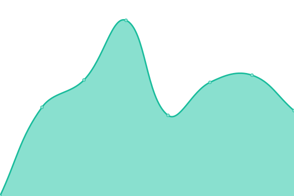
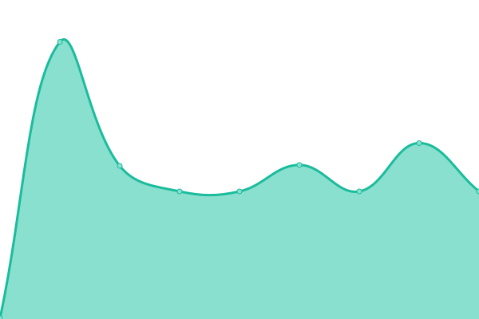
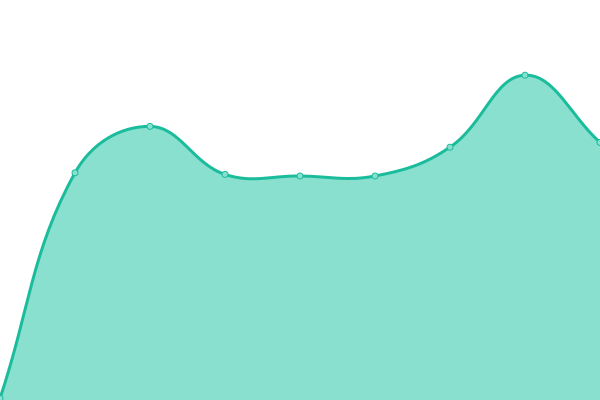

# [📈 Live Status](https://status.potatoenergy.ru): <!--live status--> **🟥 Complete outage**

This repository contains the open-source uptime monitor and status page for [Potato Energy Team](https://potatoenergy.ru/), powered by [Upptime](https://github.com/upptime/upptime).

With [Upptime](https://upptime.js.org), you can get your own unlimited and free uptime monitor and status page, powered entirely by a GitHub repository. We use [Issues](https://github.com/potatoenergy/status/issues) as incident reports, [Actions](https://github.com/potatoenergy/status/actions) as uptime monitors, and [Pages](https://status.potatoenergy.ru) for the status page.

<!--start: status pages-->
<!-- This summary is generated by Upptime (https://github.com/upptime/upptime) -->
<!-- Do not edit this manually, your changes will be overwritten -->
<!-- prettier-ignore -->
| URL | Status | History | Response Time | Uptime |
| --- | ------ | ------- | ------------- | ------ |
|  [Grafana](https://grafana.potatoenergy.ru/api/health) | Недоступно | [grafana.yml](https://github.com/potatoenergy/status/commits/HEAD/history/grafana.yml) | 

 1178мс
     
 | 

<a href="https://status.potatoenergy.ru/history/grafana">100.00%</a>
    

|  [Mastodon](https://social.potatoenergy.ru/health) | Недоступно | [mastodon.yml](https://github.com/potatoenergy/status/commits/HEAD/history/mastodon.yml) | 

 974мс
     
 | 

<a href="https://status.potatoenergy.ru/history/mastodon">100.00%</a>
    

|  [Nextcloud](https://cloud.potatoenergy.ru/login) | Недоступно | [nextcloud.yml](https://github.com/potatoenergy/status/commits/HEAD/history/nextcloud.yml) | 

 3545мс
     
 | 

<a href="https://status.potatoenergy.ru/history/nextcloud">99.44%</a>
    

|  [Open WebUI](https://chat.potatoenergy.ru/health) | Недоступно | [open-web-ui.yml](https://github.com/potatoenergy/status/commits/HEAD/history/open-web-ui.yml) | 

 1016мс
     
 | 

<a href="https://status.potatoenergy.ru/history/open-web-ui">100.00%</a>
    

|  [Mindustry](connect.potatoenergy.ru) | Недоступно | [mindustry.yml](https://github.com/potatoenergy/status/commits/HEAD/history/mindustry.yml) | 

 162мс
     
 | 

<a href="https://status.potatoenergy.ru/history/mindustry">100.00%</a>
    

|  [Minecraft](connect.potatoenergy.ru) | Недоступно | [minecraft.yml](https://github.com/potatoenergy/status/commits/HEAD/history/minecraft.yml) | 

 179мс
     
 | 

<a href="https://status.potatoenergy.ru/history/minecraft">100.00%</a>
    

|  [API](connect.potatoenergy.ru) | Недоступно | [api.yml](https://github.com/potatoenergy/status/commits/HEAD/history/api.yml) | 

 162мс
     
 | 

<a href="https://status.potatoenergy.ru/history/api">100.00%</a>
    

<!--end: status pages-->

[**Visit our status website →**](https://status.potatoenergy.ru)

## 📄 License

- Powered by: [Upptime](https://github.com/upptime/upptime)
- Code: [MIT](./LICENSE) © [Anand Chowdhary](https://anandchowdhary.com), supported by [Pabio](https://pabio.com)
- Data in the `./history` directory: [Open Database License](https://opendatacommons.org/licenses/odbl/1-0/)
