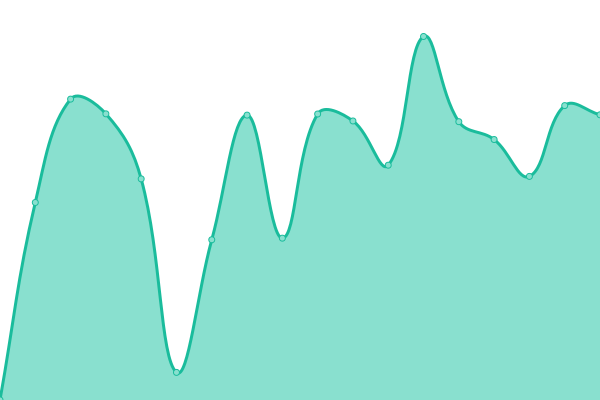

# [📈 Live Status](https://status.potatoenergy.ru): <!--live status--> **🟥 Complete outage**

This repository contains the open-source uptime monitor and status page for [Potato Energy Team](https://potatoenergy.ru/), powered by [Upptime](https://github.com/upptime/upptime).

With [Upptime](https://upptime.js.org), you can get your own unlimited and free uptime monitor and status page, powered entirely by a GitHub repository. We use [Issues](https://github.com/potatoenergy/status/issues) as incident reports, [Actions](https://github.com/potatoenergy/status/actions) as uptime monitors, and [Pages](https://status.potatoenergy.ru) for the status page.

<!--start: status pages-->
<!-- This summary is generated by Upptime (https://github.com/upptime/upptime) -->
<!-- Do not edit this manually, your changes will be overwritten -->
<!-- prettier-ignore -->
| URL | Status | History | Response Time | Uptime |
| --- | ------ | ------- | ------------- | ------ |
|  [chat.potatoenergy.ru [head]](https://chat.potatoenergy.ru/health) | Недоступно | [chat-potatoenergy-ru-head.yml](https://github.com/potatoenergy/status/commits/HEAD/history/chat-potatoenergy-ru-head.yml) | 

 0мс
     
 | 

<a href="https://status.potatoenergy.ru/history/chat-potatoenergy-ru-head">0.00%</a>
    

|  [cloud.potatoenergy.ru [get]](https://cloud.potatoenergy.ru/login) | Недоступно | [cloud-potatoenergy-ru-get.yml](https://github.com/potatoenergy/status/commits/HEAD/history/cloud-potatoenergy-ru-get.yml) | 

 3277мс
     
 | 

<a href="https://status.potatoenergy.ru/history/cloud-potatoenergy-ru-get">61.32%</a>
    

|  [potatoenergy.ru [head]](https://potatoenergy.ru/search) | Недоступно | [potatoenergy-ru-head.yml](https://github.com/potatoenergy/status/commits/HEAD/history/potatoenergy-ru-head.yml) | 

 0мс
     
 | 

<a href="https://status.potatoenergy.ru/history/potatoenergy-ru-head">0.00%</a>
    

|  [social.potatoenergy.ru [head]](https://social.potatoenergy.ru/health) | Недоступно | [social-potatoenergy-ru-head.yml](https://github.com/potatoenergy/status/commits/HEAD/history/social-potatoenergy-ru-head.yml) | 

 1375мс
     
 | 

<a href="https://status.potatoenergy.ru/history/social-potatoenergy-ru-head">61.69%</a>
    

|  [mindustry-server [port]](connect.potatoenergy.ru) | Недоступно | [mindustry-server-port.yml](https://github.com/potatoenergy/status/commits/HEAD/history/mindustry-server-port.yml) | 

 155мс
     
 | 

<a href="https://status.potatoenergy.ru/history/mindustry-server-port">61.79%</a>
    

|  [minecraft-server [port]](connect.potatoenergy.ru) | Недоступно | [minecraft-server-port.yml](https://github.com/potatoenergy/status/commits/HEAD/history/minecraft-server-port.yml) | 

 155мс
     
 | 

<a href="https://status.potatoenergy.ru/history/minecraft-server-port">60.67%</a>
    

|  [connect.potatoenergy.ru [ping]](connect.potatoenergy.ru) | Недоступно | [connect-potatoenergy-ru-ping.yml](https://github.com/potatoenergy/status/commits/HEAD/history/connect-potatoenergy-ru-ping.yml) | 

 168мс
     
 | 

<a href="https://status.potatoenergy.ru/history/connect-potatoenergy-ru-ping">62.25%</a>
    

|  [potatoenergy.ru [ping]](potatoenergy.ru) | Недоступно | [potatoenergy-ru-ping.yml](https://github.com/potatoenergy/status/commits/HEAD/history/potatoenergy-ru-ping.yml) | 

 166мс
     
 | 

<a href="https://status.potatoenergy.ru/history/potatoenergy-ru-ping">62.35%</a>
    

<!--end: status pages-->

[**Visit our status website →**](https://status.potatoenergy.ru)

## 📄 License

- Powered by: [Upptime](https://github.com/upptime/upptime)
- Code: [MIT](./LICENSE) © [Anand Chowdhary](https://anandchowdhary.com), supported by [Pabio](https://pabio.com)
- Data in the `./history` directory: [Open Database License](https://opendatacommons.org/licenses/odbl/1-0/)
